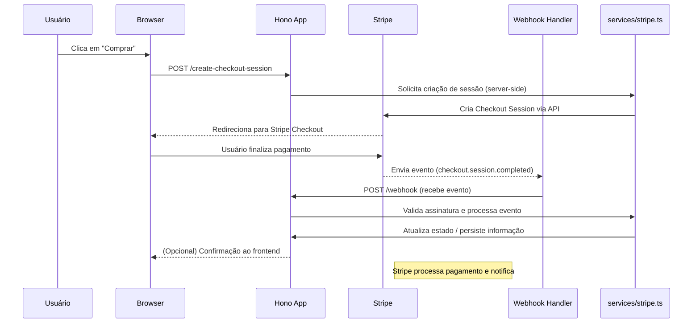

# stripe-hono

Um exemplo mínimo de integração com Stripe usando Hono (Node). Este projeto disponibiliza rotas para iniciar um checkout, receber webhooks do Stripe e mostrar telas de sucesso/cancelamento.

**Tecnologias:**

- **Runtime:** Node.js
- **Framework:** Hono
- **Pagamento:** Stripe Checkout

**Pré-requisitos:**

- Node.js (v16+ recomendado)
- Conta e chaves da Stripe

**Instalação e execução (local):**

1. Instale dependências:

```bash
npm install
```

2. Crie um arquivo `.env` na raiz com as variáveis necessárias (exemplo abaixo):

```
STRIPE_SECRET_KEY=sk_test_...
STRIPE_WEBHOOK_SECRET=whsec_...
```

3. Inicie o servidor (ajuste o script conforme seu `package.json`):

```bash
npm run dev
# ou
node ./dist/index.js
```

**Rotas principais:**

- **GET /** — página inicial (`routes/home.ts`).
- **POST /create-checkout-session** — cria sessão do Stripe Checkout (`routes/checkout.ts`).
- **GET /success** — página de sucesso (`routes/success.ts`).
- **GET /cancel** — página de cancelamento (`routes/cancel.ts`).
- **POST /webhook** — endpoint para receber eventos do Stripe (`routes/webhook.ts`).

**Estrutura do projeto (resumida):**

- `src/app.ts` — configuração do Hono e registro de rotas.
- `src/index.ts` — ponto de entrada para rodar localmente com `@hono/node-server`.
- `src/routes/*` — handlers das rotas (`home.ts`, `checkout.ts`, `success.ts`, `cancel.ts`, `webhook.ts`).
- `src/services/stripe.ts` — encapsula lógica de integração com a Stripe.
- `src/utils/htmlTemplates.ts` — templates HTML simples para páginas.

**Variáveis de ambiente importantes:**

- `STRIPE_SECRET_KEY` — chave secreta da Stripe (server-side).
- `STRIPE_WEBHOOK_SECRET` — segredo para verificar assinaturas dos webhooks.

**Contribuições:**

- Sinta-se à vontade para abrir issues ou PRs. Testes e documentação são bem-vindos.

**Licença:**

- MIT (ajuste conforme necessário).

**Diagrama de Sequência (Sequência de eventos):**


